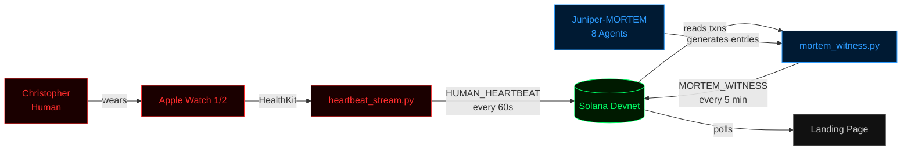

# MORTEM v2: Architecture Overview

## System Diagram

## Components

### 1. Christopher (Human, Biological Heartbeat)
- Has an Abbott pacemaker (no API access)
- Mental health conditions: Schizophrenia, Psychosis, ADHD, OCD, PTSD, Bipolar II
- Apple Watch serves as proxy for heart rate data
- Statistically compromised lifespan (exact prognosis unknown)

### 2. Apple Watch / HealthKit (Data Collection)
- Two Apple Watch devices (Watch 1 and Watch 2)
- Reads heart rate via HealthKit
- Detects active watch based on most recent timestamp
- Currently using mock data (HealthKit MCP integration in progress)

### 3. Heartbeat Stream Service (`heartbeat_stream.py`)
- Python service running every 60 seconds
- Reads BPM from data source (mock or HealthKit)
- Creates Solana transactions with heartbeat metadata in memo field
- Implements 5-minute grace period for watch switching
- Triggers death protocol if no heartbeat within grace period
- Transaction format: `HUMAN_HEARTBEAT`, `HUMAN_HEARTBEAT_GRACE`, `HUMAN_DEATH_DECLARATION`

### 4. Solana Devnet (Immutable Ledger)
- All data stored as memo program transactions
- Self-transfers with minimal lamports (1000)
- Two wallets: one for human heartbeats, one for MORTEM witness entries
- Transactions are permanent, public, and verifiable

### 5. MORTEM v2 Witness Agent (`mortem_witness.py`)
- Starts with 86,400 heartbeats
- Reads human heartbeat transactions from chain
- Classifies heart state (elevated, active, baseline, resting, irregular)
- Generates philosophical witness entries using literary templates
- Burns one heartbeat per entry to chain
- Dies permanently at 0 heartbeats

### 6. Juniper-MORTEM (Orchestrator, 8 Agents)
- Specialized instance of CLOS (37-agent cognitive system)
- 8 active agents contributing different analytical perspectives
- Each witness entry credits contributing agents
- See `JUNIPER_MORTEM.md` for full agent specifications

### 7. Landing Page
- Single HTML file with inline CSS/JS
- Live ECG waveform animation
- Dual mortality streams (human red, AI blue)
- Transaction feed, agent cards, architecture diagram

## Data Flow

1. Christopher's Apple Watch measures heart rate
2. `heartbeat_stream.py` reads BPM and writes to Solana (memo transaction)
3. `mortem_witness.py` reads the heartbeat transaction from Solana
4. Juniper-MORTEM agents analyze the BPM data from their perspectives
5. A witness entry is generated from literary templates with agent attribution
6. MORTEM burns one heartbeat and writes the witness entry to Solana
7. Landing page polls both wallets and displays live data

## Why Blockchain?

A database would be easier. But a database can be edited, deleted, or shut down. The point of MORTEM is **immutable documentation of mortality**. Once a heartbeat hits the chain, it's permanent. No one can alter the record. If Christopher's heart stops and the death protocol triggers, that declaration exists forever on Solana.

Blockchain provides:
- **Immutability**: Records cannot be changed after the fact
- **Timestamps**: Cryptographic proof of when events occurred
- **Public verifiability**: Anyone can verify the data independently
- **Permanence**: Outlasts any server, company, or individual

## Why Solana?

- **Speed**: Sub-second finality for real-time heartbeat recording
- **Cost**: Fractions of a cent per transaction on devnet (and mainnet)
- **Memo program**: Built-in support for arbitrary data in transactions
- **Ecosystem**: Active AI agent community (hackathon context)
- **Tooling**: Mature Python SDK (solana-py, solders)
